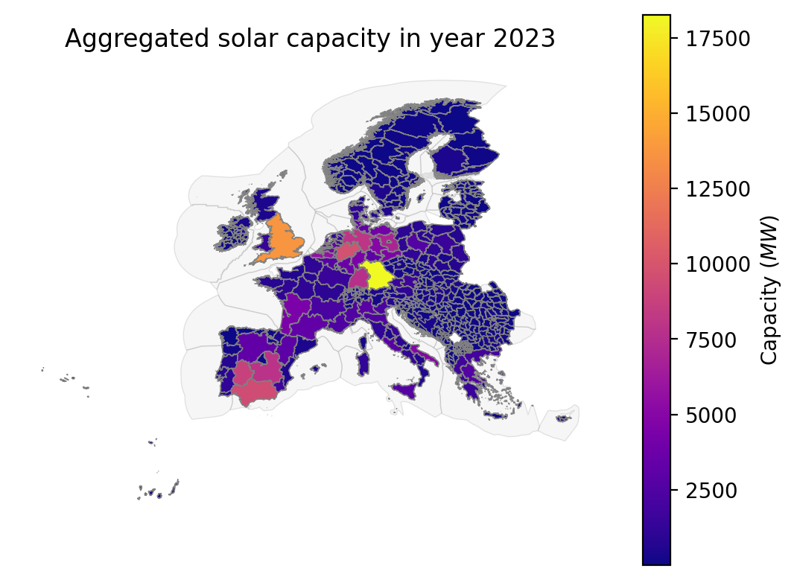
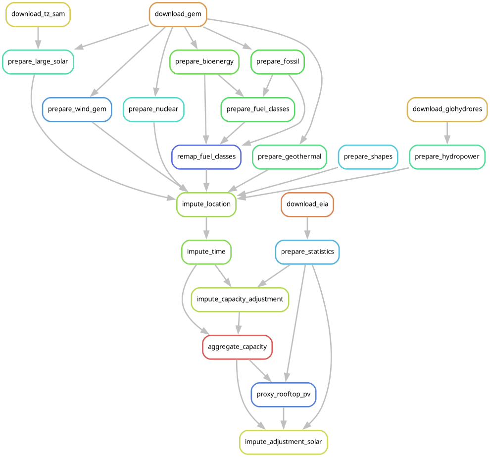
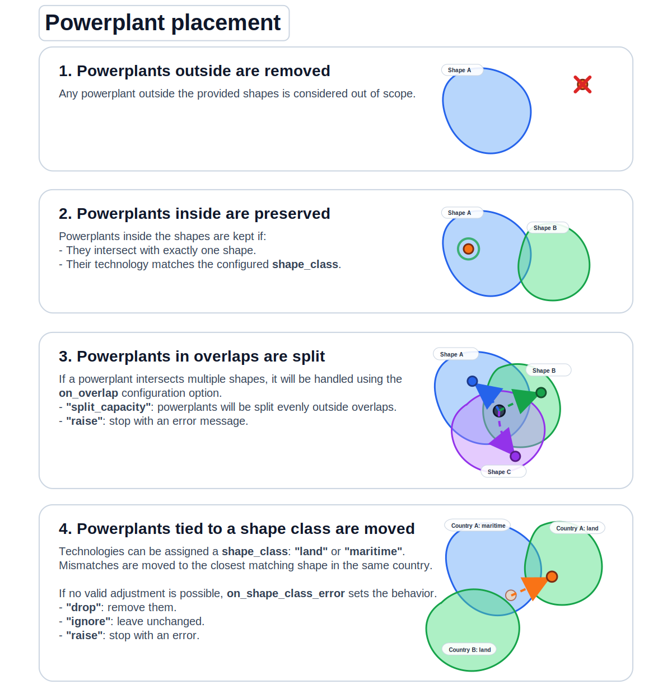
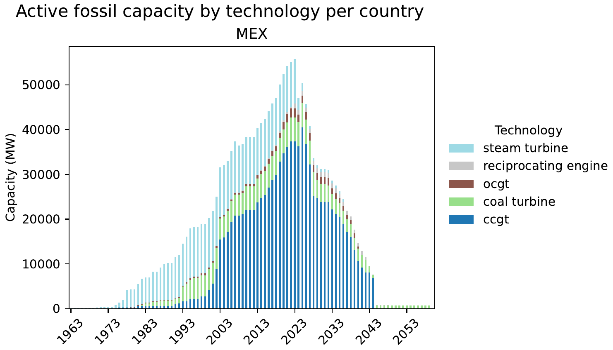
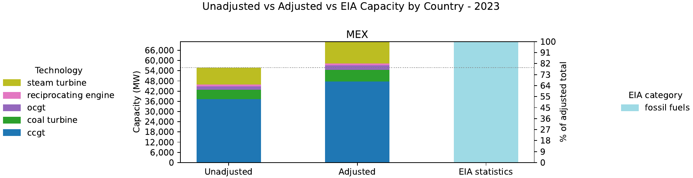
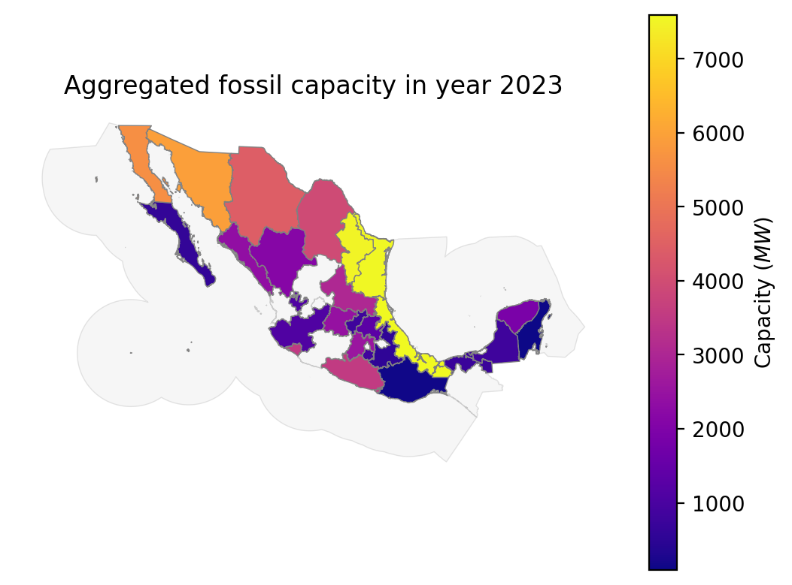
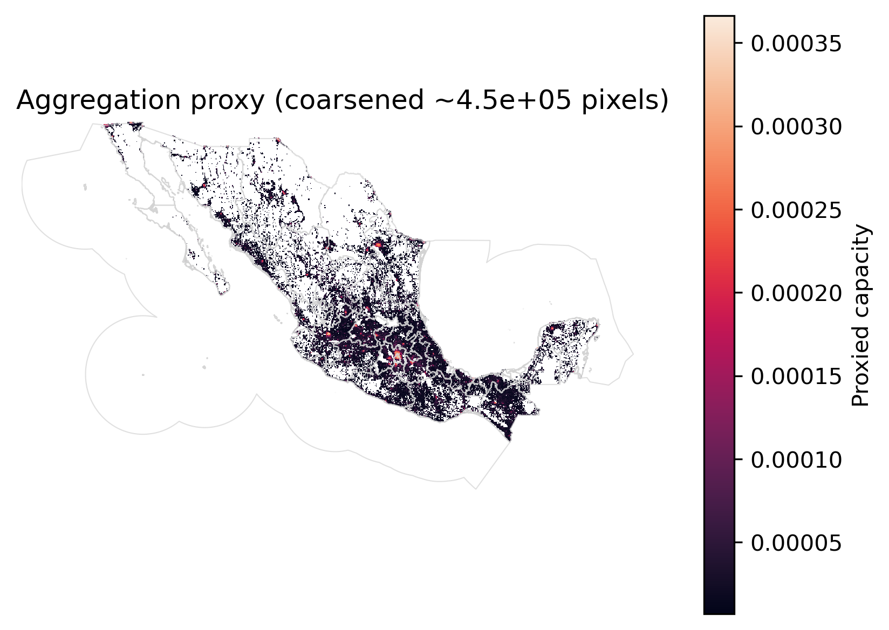

# Modelblocks - Powerplants module

Aggregate global powerplant capacities into any resolution.

<!-- Place an attractive image of module outputs here -->
<p align="center">
  
</p>


## About
<!-- Please do not modify this templated section -->

This is a modular `snakemake` workflow created as part of the [Modelblocks project](https://www.modelblocks.org/). It can be imported directly into any `snakemake` workflow.

For more information, please consult the Modelblocks [documentation](https://modelblocks.readthedocs.io/en/latest/),
the [integration example](./tests/integration/Snakefile),
and the `snakemake` [documentation](https://snakemake.readthedocs.io/en/stable/snakefiles/modularization.html).

## Overview
<!-- Please describe the processing stages of this module here -->

Data processing steps:

<p align="center">
  
</p>

1. Stable version-controlled global datasets are downloaded, including:
    - Disaggregated powerplant statistics from [GEM](https://globalenergymonitor.org/), [Transition-Zero](https://www.transitionzero.org/products/solar-asset-mapper), and [GloHydroRES](https://zenodo.org/records/14526360).
    - National-level statistics from the [EIA](https://www.eia.gov/).
2. Individual powerplants are prepared into seven different categories (bioenergy, fossil, geothermal, hydropower, nuclear, solar, wind).
    - Fuel-burning powerplants (fossil, bioenergy) are assigned unique fuel-classes depending on the combination of fuels they utilise.
    - For utility-scale solar projects, satellite detected [TZ-Solar Asset Mapper](https://www.transitionzero.org/products/solar-asset-mapper) facilities are matched to [GEM-Global Solar Power Tracker](https://globalenergymonitor.org/) data to obtain a highly complete dataset of large-scale solar facilities.
3. Powerplants are selected according to the shapes file provided by the user. Depending on the configuration, their placement may be adjusted per technology and country.

<p align="center">
  
</p>

4. Powerplant start and end dates are imputed per category/technology using the configuration.
    - `lifetime_years` determines overall technology lifetime.
    - `retirement_delay_years` determines the remaining years of powerplants currently operating beyond their expected lifetime.

<p align="center">
  
</p>

> [!NOTE]
> Powerplant start/end dates are only imputed if they are not provided in the original dataset.

5. Optionally, powerplant capacities are adjusted evenly per category and country to match EIA statistics.


<p align="center">
  
</p>

> [!IMPORTANT]
> This stage may significantly inflate/deflate individual powerplants.
> We encourage users to carefully assess if this adjustment is merited by their use-case.

6. Powerplant capacity is aggregated to the provided shapes, for either adjusted or unadjusted powerplants.

<p align="center">
  
</p>

7. Solar is processed as a special case because rooftop PV panels are not covered in GEM or Transition-Zero data.
    1. Per country: $solar_{rooftop\_PV} = solar_{national\_statistics} - solar_{large\_scale}$.
    2. A user-provided proxy raster is used to determine how to disaggregate $solar_{rooftop\_PV}$.
    3. This proxy is used to determine the aggregated rooftop PV capacity per-shape.

<p align="center">
  
</p>

> [!NOTE]
> Due to this assumption, the lifetime of rooftop PV capacity is left undetermined.


## Configuration
<!-- Please describe how to configure this module below -->

Please consult the configuration [README](./config/README.md) and the [configuration example](./config/config.yaml) for a general overview on the configuration options of this module.

## Input / output structure
<!-- Please describe input / output file placement below -->

Please consult the [interface file](./INTERFACE.yaml) for more information.

## Development
<!-- Please do not modify this templated section -->

We use [`pixi`](https://pixi.sh/) as our package manager for development.
Once installed, run the following to clone this repository and install all dependencies.

```shell
git clone git@github.com:modelblocks-org/module_powerplants.git
cd module_powerplants
pixi install --all
```

For testing, simply run:

```shell
pixi run test-integration
```

To test a minimal example of a workflow using this module:

```shell
pixi shell    # activate this project's environment
cd tests/integration/  # navigate to the integration example
snakemake --use-conda --cores 2  # run the workflow!
```

## References
<!-- Please provide thorough referencing below -->

This module is based on the following research and datasets.
For specific versions please consult our [stable dataset repository](https://doi.org/10.5281/zenodo.16779120).

* **Global Energy Monitor datasets.** <https://globalenergymonitor.org/>. License: CC BY 4.0.
    - Global Bioenergy Power Tracker
    - Global Coal Plant Tracker
    - Global Geothermal Power Tracker
    - Global Nuclear Power Tracker
    - Global Oil and Gas Plant Tracker
    - Global Solar Power Tracker
    - Global Wind Power Tracker
* **Global Hydropower powerplants.**
Shah, J., Hu, J., Edelenbosch, O., & van Vliet, M. T. H. (2024). GloHydroRes - a global dataset combining open-source hydropower plant and reservoir data [Data set]. Zenodo. <https://doi.org/10.5281/zenodo.14526360>. License: CC BY 4.0.
* **National capacity dataset.**
U.S. Energy Information Administration (Oct 2008). <https://www.eia.gov/international/overview/world>. License: Public domain.
* **Satellite Utility-scale PV dataset.**
TransitionZero Solar Asset Mapper, TransitionZero. <https://www.transitionzero.org/products/solar-asset-mapper>.
License: CC BY-NC 4.0.
